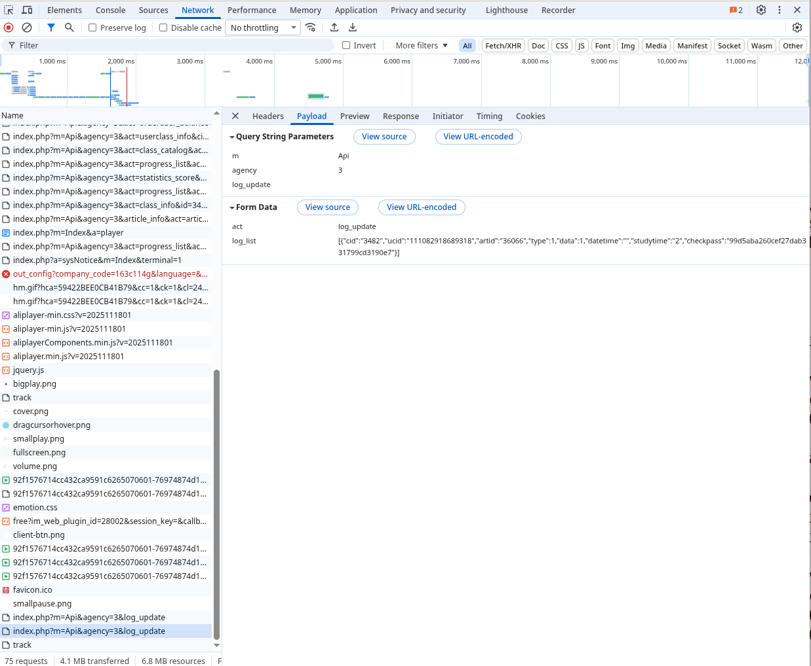

# FastLearn

快速学习： https://peixun.amac.org.cn/

学习记录通过下面这个request上传


```javascript
fetch("https://peixun.amac.org.cn/index.php?m=Api&agency=3&log_update", {
  "headers": {
    "accept": "*/*",
    "accept-language": "en-US,en;q=0.9",
    "content-type": "application/x-www-form-urlencoded; charset=UTF-8",
    "sec-ch-ua": "\"Chromium\";v=\"142\", \"Google Chrome\";v=\"142\", \"Not_A Brand\";v=\"99\"",
    "sec-ch-ua-mobile": "?0",
    "sec-ch-ua-platform": "\"Linux\"",
    "sec-fetch-dest": "empty",
    "sec-fetch-mode": "cors",
    "sec-fetch-site": "same-origin",
    "x-requested-with": "XMLHttpRequest"
  },
  "referrer": "https://peixun.amac.org.cn/index.php?a=studyDetail&m=Index&cid=3482&ucid=111082918689318&artid=36066&fid=36065",
  "body": "act=log_update&log_list=%5B%7B%22cid%22%3A%223482%22%2C%22ucid%22%3A%22111082918689318%22%2C%22artid%22%3A%2236066%22%2C%22type%22%3A1%2C%22data%22%3A1%2C%22datetime%22%3A%22%22%2C%22studytime%22%3A%222%22%2C%22checkpass%22%3A%2299d5aba260cef27dab331799cd3190e7%22%7D%5D",
  "method": "POST",
  "mode": "cors",
  "credentials": "include"
});
```

`log_list` 里面的studytime就是已经学习的时长

需要注意几点：

1. 提交的记录中学习时长不能超过实际视频时常，否则当前视频永远不会认为学习完成。因此需要获取视频url并获得时长

2. 提交的记录会保留一段时间（大概10s）视频未学习，人工等待其到最后

2. 提交记录完成后，网站并不能立即认证学习完成，因为实际时间太短，所以最后并不会弹出课程学习完成的对话框。因此需要等一会（比如30min后）再把最后几秒钟看完即可